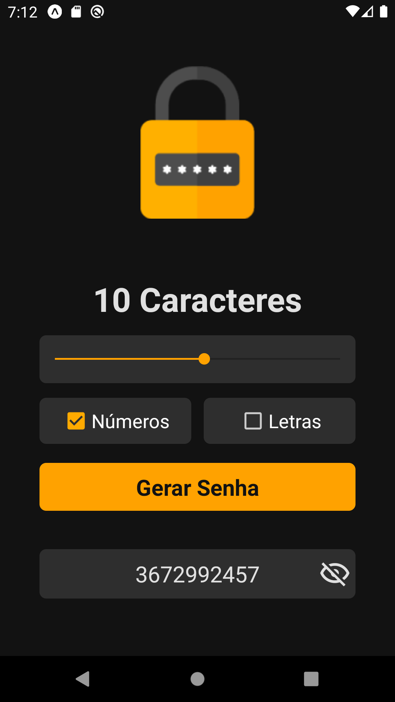
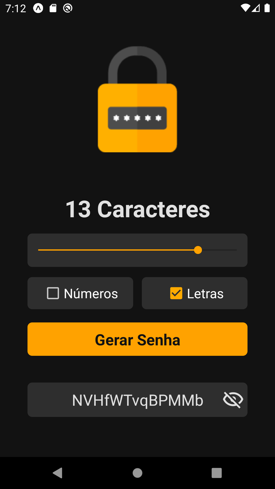
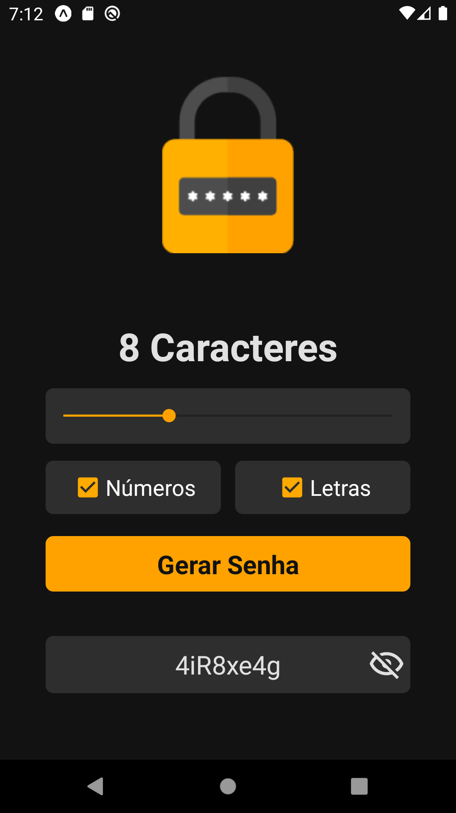
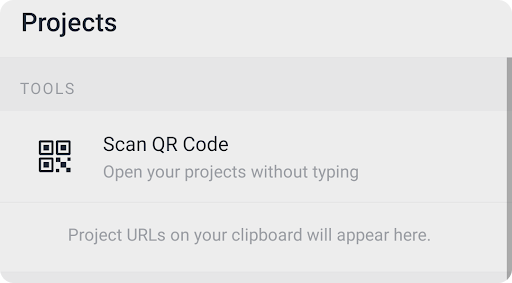

<div align="center">
  
  <p align="center">Gerador de senhas aleatorias</p>
  
  
</div>

<h1 align="center">Password Generator Insider 2.0</h1>

<p>O Insider é um evento que o @SujeitoProgramador disponibiliza ao público e em cada temporada ele trás uma proposta de aplicativo diferente.</p>
<p>Você não precisa ter conhecimento algum para participar, pois ele sempre ensina do zero ao app ou seja, você consegue desenvolver o app sem saber nada de programação e assim que finalizar você vai ter uma base na área.</p>
<p>No Insider 2.0 a proposta foi criar um aplicativo mobile(android/ios) pra gerar senhas aleatórias </p>

<h1 align="center">:mag_right: Preview do Projeto</h1>

<div align="center">
  
  
  
</div>

## :hammer: Pré-requisitos

Antes de começar, você vai precisar ter instalado em sua máquina as seguintes ferramentas:
[Git](https://git-scm.com), [Node.js](https://nodejs.org/en/), [Expo](https://expo.io/),
Além disto é bom ter um editor para trabalhar com o código como [VSCode](https://code.visualstudio.com/)

## :game_die: Rodando o Aplicativo

```bash
# Clone este repositório
$ git clone https://github.com/ErikPervious/Password-Generator.git

# Acesse a pasta do projeto no terminal/cmd
$ cd Password-Generator

# Instale o projeto na sua máquina
$ yarn install

# Execute a aplicação
$ yarn start

# Ou use o próprio Expo
$ expo start
```

## :calling: Abrindo no smartphone

* Baixe o aplicativo Expo Go na sua [Play Store](https://play.google.com/store/apps/details?id=host.exp.exponent&hl=pt_BR&gl=US) ou na [App Store](https://apps.apple.com/br/app/expo-go/id982107779).

* Abra o app, conceda as permissões necessárias e aperte no ***Scan QR Code***.

<div align="center">
  
</div>

* Escaneie o QR Code que irá abrir no seu CMD/Terminal.

* Agora aguarde o Metro Blunder carregar e pronto.

## 🛠 Tecnologias

As seguintes ferramentas foram usadas na construção do projeto:

- [Expo](https://expo.io/)
- [Node.js](https://nodejs.org/en/)
- [React Native](https://reactnative.dev/)

## 📄 Licença

Esse projeto está sob a licença GNU. Veja o arquivo [LICENSE](LICENSE) para mais detalhes.
